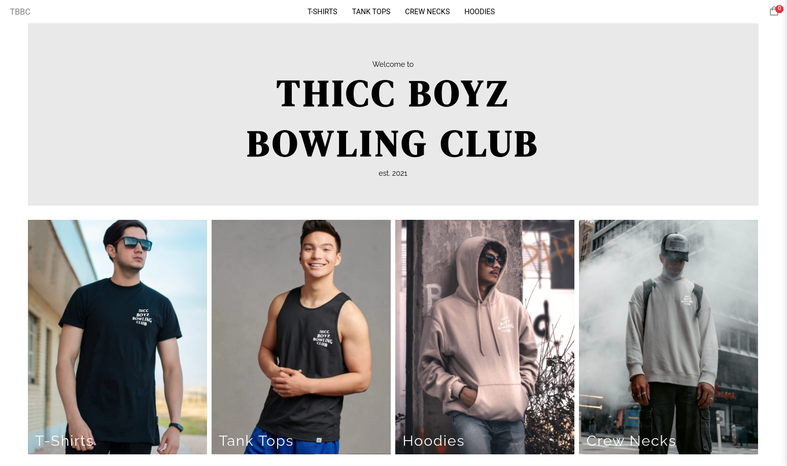
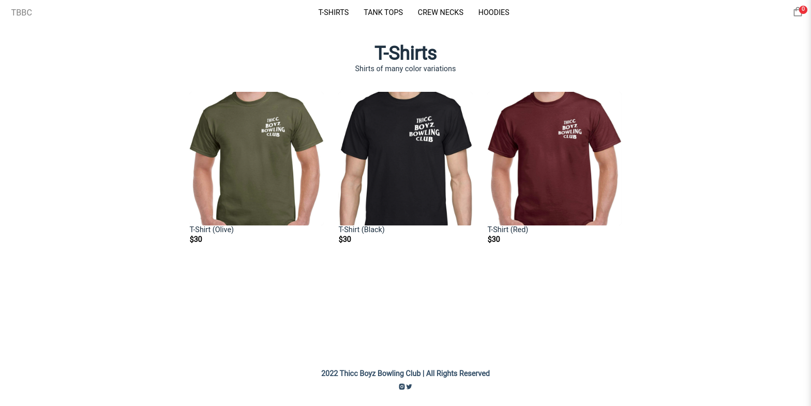
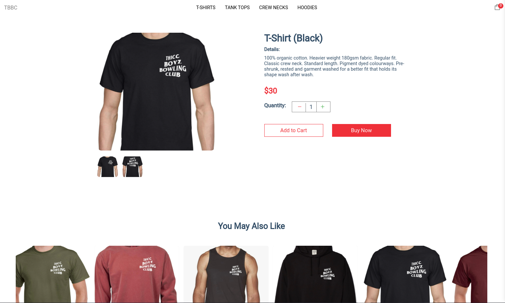
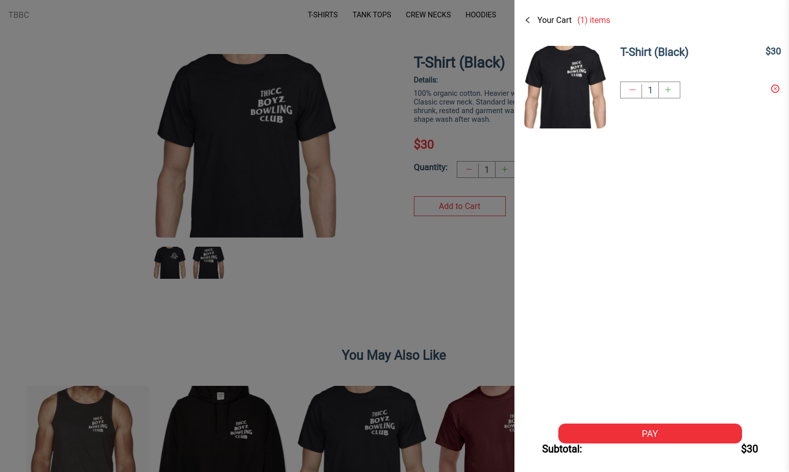
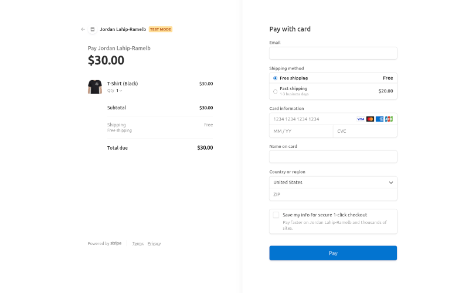
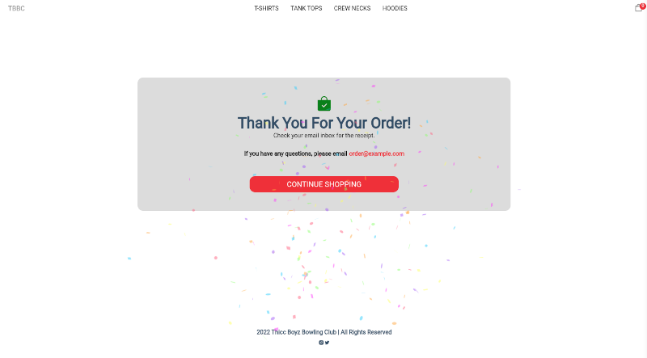

# Thicc Boyz Bowling Club Ecommerce

Link: https://thiccboyzbowlingclub-shop.vercel.app/

## Description

**Thicc Boyz Bowling Club Ecommerce** is an eCommerce website that allows users to navigate through its products and allows them to add/remove these products from their cart. Furthermore, the user is able to complete checkout with the integration of Stripe.

## What is Thicc Boyz Bowling Club?

Bowling is one of my favorite hobbies. I participate in a league at one of the casinos here in town in Las Vegas along with 3 other members. Our team name is **Thicc Boyz Bowling Club**. We designed shirts for our team which resembles the products seen on this website. These shirts have been asked about numerous times so I decided to create a mock website in order to advance my development skills as well as possibly creating a website where we could sell our brand.

## Technologies Utilized

- HTML
- JavaScript
  - ReactJS/NextJS
- CSS
- Sanity.io
  - Backend for managing products
- Stripe payments

## Screenshots

